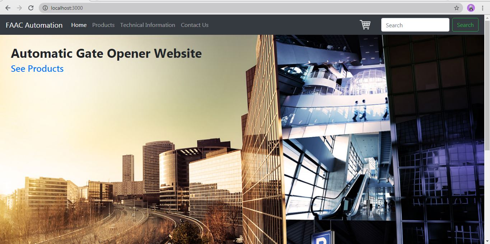
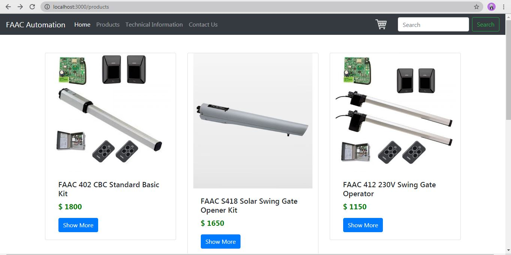
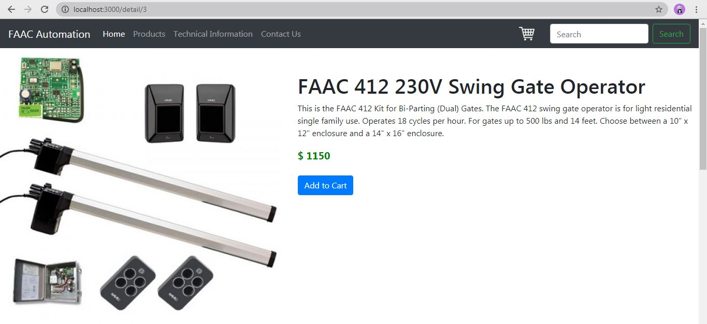
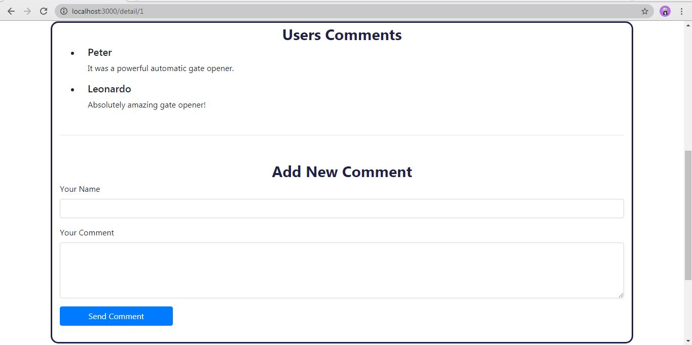
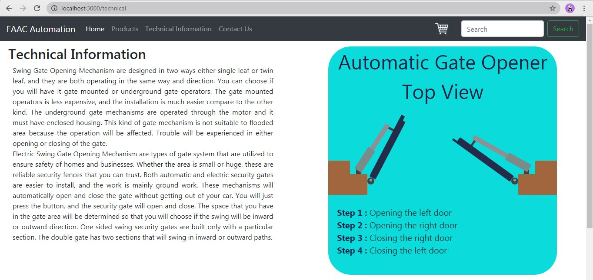
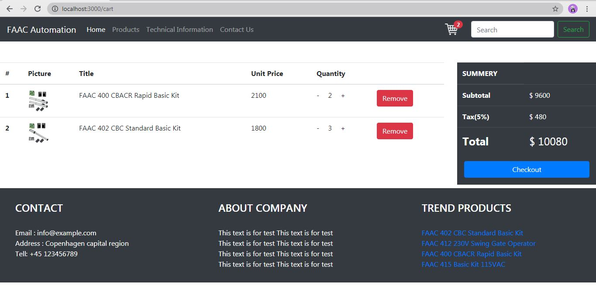

# Automatic-Gate-Opener-Website

This is a `React app` project designed for selling automatic gate openers.

I utilized some technologies like `HTML`, `CSS`, `JavaScript`, `React`, `Redux` , `Node.js` , `Bootstrap` and `Git`.

### This video shows the performance of the website:

### Quick Start

At first, open server-api directory and run commands below on cmd:

`npm install`
 
`npm start`

The server will run on port 5000.

Then, run the command below on cmd, in main directory to run React app on port 3000.

`npm start`

### Web Pages Introduction

#### Home Page

It's the landing page of the website. User access to navbar, footer and a direct link to products.

#### Products Page

Users can access to all of the products, in terms of image, name, price and a link to shop page.

#### Detail Page

In this page, users can access to products description and a button for adding to cart.

Moreover, there is the possibility for users to leave a comment, which can be seen by other users.

#### Thechnical Information Page

In the first part, some thecnical information is provided. Following, there is an animation showing mechanism of automatic gate opener.

#### Cart Page

In the cart page, users can see products which added to cart, change their quantities or remove them.

